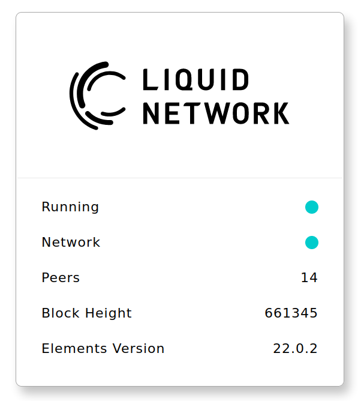

# NodeMonitor is a simple Python Flask website that makes calls to a Liquid node (elements-qt or elementsd) using RPC and displays the results on a simple 'dashboard' style status page.

Set RPC details for your node in config.py

To use testnet Liquid use the config here (remove RPC username and password to use cookie auth instead): [https://liquidtestnet.com](https://liquidtestnet.com)

Install requirements and run:

```
pip install -r requirements.txt

flask run
```

Browse to http://127.0.0.1:5000


